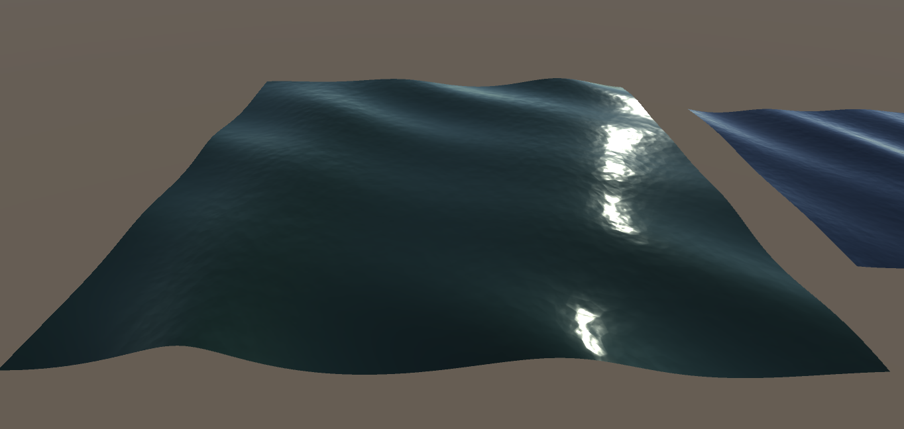
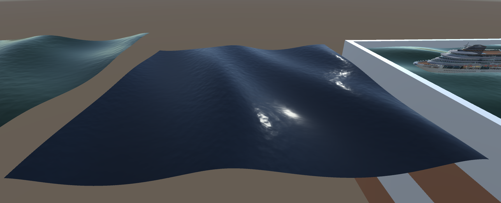
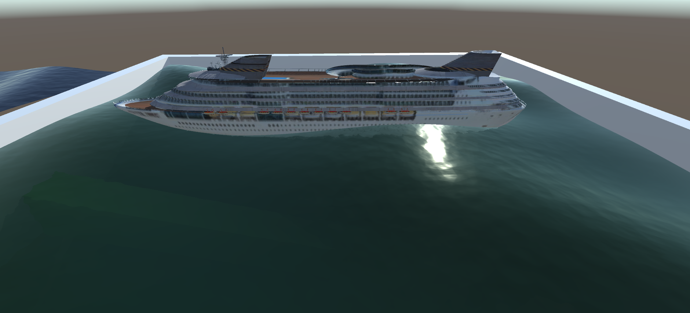

# Simple Water Rendering

by Alejandro Vega

## Features

* Sum Of Sines Fluid Simulation (from Catlike Coding)
* * Sine Wave
* * Sum of sinus
* * Gerstner Waves
* Albedo fluid animation
* * UVs animation
* * Texture distortion and looping
* Basic transparency
* * Water fog + Fog color
* * Underwater Refraction

*Shaders or scripts are not optimized, just demo ready*

## What's Missing?

* Buoyancy
* Atmospheric shader

## Examples

### 6 Iterations Gerstner Wave

### 4 Iterations Gerstner Wave

### Transparency sample scene

## References

https://catlikecoding.com/unity/tutorials/flow/

https://www.youtube.com/watch?v=PH9q0HNBjT4

https://gpuopen.com/gdc-presentations/2019/gdc-2019-agtd6-interactive-water-simulation-in-atlas.pdf

https://developer.nvidia.com/gpugems/gpugems/part-i-natural-effects/chapter-1-effective-water-simulation-physical-models

